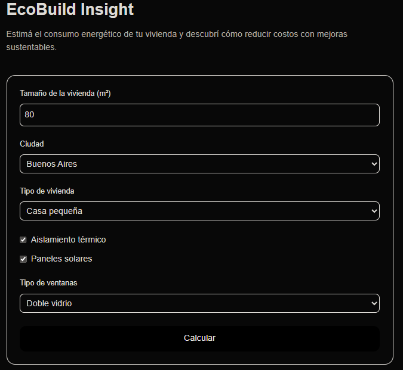

# TinyWiki

**Sustainability knowledge and energy decision tools for Argentina / LATAM**

Active development • 26 weekly sprints • Build in public

---

## Project Preview



---

## What is TinyWiki?

TinyWiki is an experimental sustainability and energy platform focused on Argentina and LATAM.

The project combines:

- Curated sustainability knowledge
- Practical educational resources
- Energy estimation tools
- Decision-support experiences
- Structured information with future analytics potential

The goal is to create a practical and accessible ecosystem where users can explore sustainability topics, evaluate energy-related decisions, and access actionable information through a minimal and lightweight experience.

TinyWiki is intentionally built with a low-complexity and iterative approach, prioritizing clarity, maintainability, and long-term development.

---

## Six-Month Retrospective

TinyWiki has been developed through **26 weekly sprints** over approximately six months.

What started as a minimal sustainability wiki gradually evolved into a broader experimental platform that combines content, energy tools, and practical decision-support experiences.

Development follows a sprint-based workflow with continuous iteration, public progress documentation, and progressive feature expansion.

The project serves simultaneously as:

- A real-world side project
- A technical learning environment
- A portfolio and experimentation platform
- A long-term product exploration

---

## Current Features

### Wiki

- Curated sustainability content
- Practical and scannable resources
- Source-oriented information structure
- MDX-based content system

### Tools

Current tools include:

- Solar readiness checklist
- Solar estimation calculator
- Thermotank readiness checklist
- EcoBuild Insight

### EcoBuild Insight

EcoBuild Insight evolved into a lightweight residential energy assessment experience.

Features include:

- Energy consumption estimation
- City-based energy factors
- ROI calculations
- Personalized recommendations
- Energy benchmark comparison
- Methodology transparency section
- Suggested improvement plans
- Readiness summary
- Exportable report workflow
- Service-oriented call to action

### Services

TinyWiki currently includes service-oriented experimentation through:

- Energy analysis landing page
- Consultation-oriented CTA flow
- Future lead generation exploration

---

## Tech Stack

TinyWiki is currently built with:

- Next.js (App Router)
- React
- TypeScript
- TailwindCSS
- MDX content
- Vercel deployment

Future integrations may include:

- Structured datasets
- Analytics layers
- BI dashboards
- Spreadsheet-driven workflows

---

## Repository Structure

```text
apps/
└── web/
    ├── src/app/
    ├── src/content/wiki/
    ├── src/lib/
    └── public/

docs/
├── screenshots/
└── roadmap/
```

Main areas:

- `apps/web/` — Next.js web application
- `src/content/wiki/` — Wiki and MDX content
- `src/lib/` — Tool logic and helper modules
- `docs/screenshots/` — Sprint and development screenshots
- `docs/` — Project documentation and roadmap assets

---

## Local Development

Clone the repository:

```bash
git clone https://github.com/dochronos/tinywiki.git
```

Install dependencies:

```bash
cd apps/web
npm install
```

Run locally:

```bash
npm run dev
```

Open:

```text
http://localhost:3000
```

---

## Development Roadmap

### Phase 1 — Functional Core ✅

Completed through Sprint 25:

- Wiki foundation
- Tools ecosystem
- EcoBuild Insight
- Energy reporting layers
- Services experimentation
- Sprint documentation

### Phase 2 — UI/UX + Branding 🚧

Current direction:

- Design consistency
- Visual identity
- UX refinement
- Product cohesion
- GitHub and presentation polish

### Future Exploration

Potential future areas:

- Sustainability datasets
- Analytics and BI integration
- Expanded tools ecosystem
- Monetization experimentation
- LATAM-oriented sustainability resources

---

## Vision

TinyWiki aims to become a practical sustainability and energy knowledge platform for Argentina and LATAM.

The project prioritizes useful information, lightweight tools, and gradual evolution through real-world experimentation and long-term iteration.

---

## License

MIT